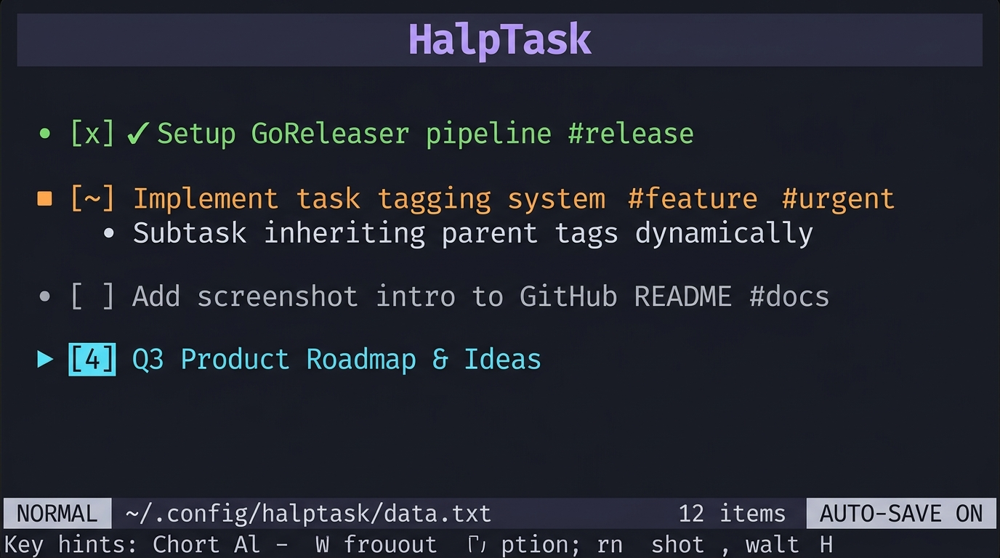
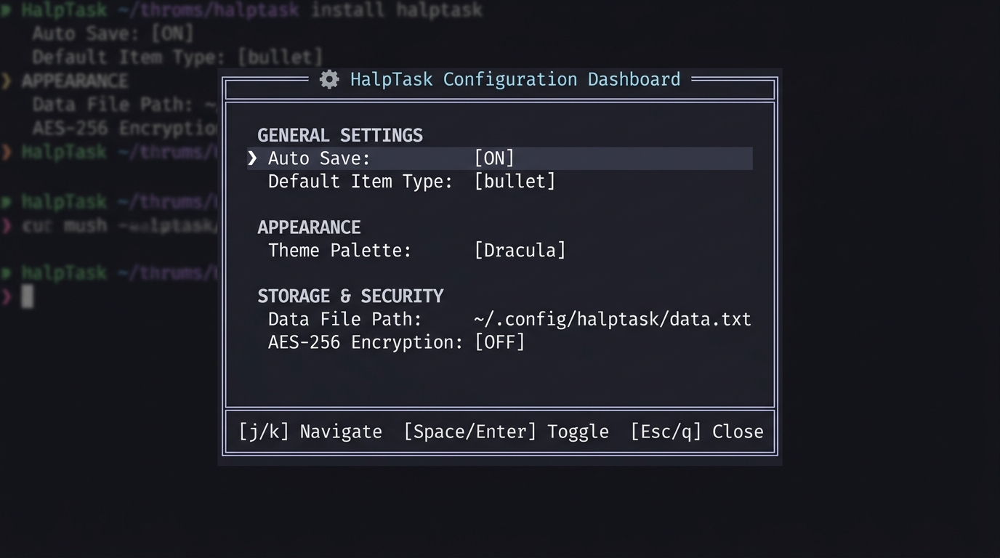

# User Personas & Tailored Workflows 👥

HalpTask is built to adapt to diverse professions and workflow styles. Whether you are writing code, auditing legal contracts, managing production servers, or orchestrating product roadmaps, HalpTask provides structure, speed, and privacy.

---

## 👩‍💻 1. Programmers & Software Engineers

Developers need fast task capture without leaving the terminal or context-switching out of Vim/Neovim/Tmux.

<p align="center">
  
</p>

### Key Features Used:
- **Subtree Hoisting (`ff`)**: Isolate focus on a specific feature branch or component without visual clutter from other projects.
- **Direct Vim Motions (`oo`, `oc`, `dd`, `J`, `K`)**: Manipulate code task lists at touch-typing speed.
- **Tag Categorization (`#bug`, `#feature`, `#refactor`, `#review`)**: Label tasks for rapid filtering.
- **Terminal & Editor Harmony (`<space> c e` / Tmux split)**: Keep HalpTask open in a dedicated Tmux pane next to Neovim.

### Recommended Outliner Structure:
```markdown
- 🚀 Feature: Authentication Refresh
  - [~] Implement OAuth2 PKCE flow #backend #urgent
    - [x] Configure token refresh endpoint
    - [~] Add unit tests for expired session handling
  - [ ] Add biometrics option for mobile #frontend
  - 🐛 Bug Reports
    - [ ] #142 Token storage memory leak #bug #prio1
```

### Pro Tip for Developers:
Add a shell alias in your `~/.zshrc` or `~/.bashrc`:
```bash
alias todo="halptask -f ~/code/todo.txt"
alias devtasks="halptask -f ./.tasks.txt"
```

---

## 🛠️ 2. DevOps, SRE & System Administrators

DevOps engineers handle high-stakes incident response runbooks, infrastructure maintenance checklists, and credential safety.

### Key Features Used:
- **AES-256-GCM Encryption (`<space> e e` / `--encrypt`)**: Encrypt server runbooks, IP lists, and deployment keys with PBKDF2 passphrase protection.
- **Hierarchical Folds (`zM` / `zR` / `za`)**: Keep long incident response manuals folded until specific procedures are needed.
- **Status Progress Tracking (`[~]` In-Progress & Live Dashboard `<space> d`)**: Track active deployment steps and monitor progress percentage in real-time.

### Recommended Outliner Structure:
```markdown
- 🚨 Incident Runbook: DB Failover Procedure
  - [x] Step 1: Verify primary node heartbeats #devops
  - [~] Step 2: Promote replica node #devops #urgent
    - [x] Pause incoming write traffic
    - [~] Execute pg_promote() on target db-02
  - [ ] Step 3: Update DNS routing & test connection pool
- ☁️ Infrastructure Setup: Kubernetes Cluster v1.30
  - [ ] Provision node pools across AZs #aws
```

### Pro Tip for DevOps:
Use `halptask --encrypt -f ~/.config/halptask/vault.txt` for your secure infrastructure credentials vault. If you get called for on-call incidents, your runbook is instant to navigate via `j`/`k` and `l` (expand fold).

---

## 👔 3. Product Managers & Agile Leads

Product managers manage complex epics, user stories, release criteria, and cross-functional team priorities.

<p align="center">
  
</p>

### Key Features Used:
- **Dynamic Tag Inheritance (`[↖ tag]`)**: Tag a top-level Epic with `#v2.0` or `#prio1`. Every user story and subtask automatically inherits the tag, maintaining team alignment.
- **Default Task Mode Toggle (`<space> c d`)**: Switch default item creation to `task` mode when breaking down sprint backlogs.
- **Purge Completed Tasks (`da`)**: Clean up sprint backlogs at the end of every sprint cycle while archiving finished milestones.

### Recommended Outliner Structure:
```markdown
- 📦 Epic: User Onboarding Redesign #v2.0 #prio1
  - 🎨 UI/UX Specifications
    - [x] Finalize Figma prototypes #design
    - [~] Review accessibility contrast standards #design
  - ⚡ Core User Stories
    - [~] 1-Click Social Sign-in #user-story
      - [x] Google OAuth
      - [~] Apple ID Integration
  - 📊 Success Metrics
    - [ ] Track 7-day conversion rate improvement
```

---

## ⚖️ 4. Lawyers & Legal Professionals

Legal practice demands absolute client confidentiality, meticulous clause-by-clause case breakdown, and strict task deadlines.

### Key Features Used:
- **AES-256-GCM Hardware-Grade Encryption**: Ensure client files meet strict data privacy and legal compliance requirements (`AES-256` + 100k iteration PBKDF2).
- **Hierarchical Clause & Case Nesting**: Subdivide litigation steps into discovery, motion drafting, exhibit indexing, and court filings.
- **Multi-File Vaults (`halptask -f client_smith_2026.txt`)**: Keep each client's case file strictly separated in isolated data files.

### Recommended Outliner Structure:
```markdown
- ⚖️ Case: Smith v. Acme Corp (Ref #2026-884) <!-- fold -->
  - 📁 Discovery Phase #litigation
    - [x] Review initial document production
    - [~] Draft Interrogatories #urgent
      - [x] Interrogatory #1-10: Corporate Structure
      - [~] Interrogatory #11-20: Financial Audits
  - 📝 Contract Review: Master Services Agreement
    - [ ] Clause 4.2 (Indemnification): Draft counter-proposal
    - [ ] Clause 8.1 (Termination): Verify 30-day notice requirement
```

---

## 🧠 5. Researchers, Writers & Knowledge Workers

Writers, academics, and researchers require outline flexibility to organize thoughts, book chapters, paper drafts, and study topics.

### Key Features Used:
- **Bullet & Task Hybrid Outlining**: Seamlessly mix research notes (`•`) with actionable writing tasks (`[ ]`).
- **WhichKey Menu Hints (`<space>`)**: Effortless navigation without memorizing complex menu structures.
- **Real-Time Text Search (`/`)**: Instant keyword searching and highlight navigation across extensive research notes.

### Recommended Outliner Structure:
```markdown
- 📚 Research: Distributed Consensus Algorithms
  - 📄 Paxos vs Raft Comparison Notes
    - Leader election dynamics in partial network partitions
    - Log compaction strategies in production implementations
  - [~] Chapter 3: Safety & Liveness Guarantees #drafting
    - [x] Write section 3.1: State Machine Replication
    - [~] Write section 3.2: Byzantine Fault Tolerance #writing
```

---

## 📊 Summary Comparison Matrix

| Profession | Key Feature Focus | Primary Tag Strategy | Security Mode |
|---|---|---|---|
| **Programmers** | Subtree Hoisting (`ff`), Vim Motions | `#bug`, `#refactor`, `#review` | Standard Markdown |
| **DevOps / SRE** | Folds (`zc`/`zo`), Live Dashboard | `#devops`, `#aws`, `#urgent` | AES-256 Encrypted Vault |
| **Product Managers** | Dynamic Tag Inheritance, Default Task Toggle | `#v2.0`, `#prio1`, `#design` | Standard Markdown |
| **Lawyers** | Client Confidentiality, Isolated Files | `#litigation`, `#contract`, `#discovery` | AES-256 Encrypted Vault |
| **Researchers** | Hybrid Bullet/Task Outlining, Real-time Search | `#research`, `#drafting`, `#chapter1` | Standard / Encrypted |
